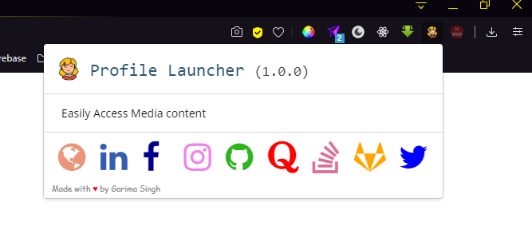

<!-- ALL-CONTRIBUTORS-BADGE:START - Do not remove or modify this section -->
[](#contributors-)
<!-- ALL-CONTRIBUTORS-BADGE:END -->

# This project is a part of Student Code In 2020 👣
  OPEN SOURCE CONTEST - STUDENT CODE IN
  ### About Student Code In 💻
  Student Code-in is a global program that helps students grow with “OPEN SOURCE”. It is a 2 months long Open-Source initiative that provides you the best platform to improve your skills and abilities by contributing to a vast variety of OPEN SOURCE Projects. In this, all the registered participants would get an exquisite opportunity to interact with the mentors and the Organizing Team. 

<div align="center">


</div>


⭐ [Check out the website of Student Code In 2020](https://scodein.tech/)

# 👣 Profile Extension




A profile 🔎 search engine for accessing my all social media profile in one tap.👨‍💻👩‍. This chrome extension lets you track your profiles on any account in a single click.

## 📋 Table of Contents
 ➡️   [Vision](#-vision)

 ➡️   [Project Structure](#-project-structure)
 
 ➡️   [Tech Stack](#-tech-stack)
 
 ➡️   [Setup Development Environment](#-steps-to-setup-development-environment)

 ➡️   [Development Guidelines](#-development-guidelines)
 
 ➡️   [Learning Resources](#-learning-resources)
 
 ➡️   [Simple things to keep in mind](#-simple-things-to-keep-in-mind)


 
 ➡️   [System Requirements](#-system-requirements)
 
 ➡️   [Contributing](#-contributing)
 
 ➡️   [Owner](#-owner)


## 👩‍ Vision
Getting all your social media profiles under one button click so that you don't have to manually search and do the hassle of searching your profile handles while making your resume, filling job opportunities forms, registering for events, etc.

## ❤️ Inspiration
This is motivated by [Traversy Media tutorial on Google Chrome Extention](https://www.youtube.com/watch?v=wHZCYi1K664).

## 🤷 Project Structure
    .
    ├── ...
    ├── images
    │── icons, logo and screenshots
    │── manifest
    │── popup.html
    |── popup.js
    |── README
    └── ...
    
## 🔆 Tech Stack
-  HTML
-  CSS
-  JavaScript


## 🚀 Steps to setup development environment
1.  Clone the repo
 ```bash
 git clone github.com/your_username/profext.git
 ```
 2. Open the folder in your favorite code editor and start adding modifications.
 3.  Load the folder in `chrome://extensions/` on chrome (Load unpacked)

 ## 💻 Development guidelines

1.  Put all the code in one of the existing files in  `/src`. If you add a new file, make a relevant modification to  `build.js`.
    
3.  Push all the code to your own branch. Once you are sure it is working, merge it with the `dev`  branch. Let's maintain only the stable and released versions on the  `master`  branch.
    
4.  Write a kick-ass, readable, and clean code.
    
5.  Load the  `/build`  folder in  `chrome://extensions/`  on chrome (Load unpacked)

## 📝 Learning Resources

Read these articles to get a quick grab on making Chrome extensions:
- [Google Chrome official docs](https://developer.chrome.com/extensions)
- [Free Code Camp's article on # How to Create and Publish a Chrome Extension in 20 minutes](https://www.freecodecamp.org/news/how-to-create-and-publish-a-chrome-extension-in-20-minutes-6dc8395d7153/)

Resources to learn Git:
-  https://try.github.io/

## 🧐 Simple things to keep in mind 
- The first step is to create a manifest file named `manifest.json`. This is a metadata file in JSON format that contains properties like your extension’s name, description, version number, and so on. In this file, we tell Chrome what the extension is going to do, and what permissions it requires.
- To test if the extension works, visit `chrome://extensions` in your browser and ensure that the **Developer mode** checkbox in the top right-hand corner is checked.
- Click **Load unpacked extension** and select the directory in which your extension files live. If the extension is valid, it will be active straight away so you can open a new tab to see your extension.
- When your first Chrome extension looks nice and works as it should, it’s time to publish it to the Chrome Store. Simply follow [this link](https://chrome.google.com/webstore/developer/dashboard) to go to your Chrome Web Store dashboard (you’ll be asked to sign in to your Google account if you’re not). Then click the `**Add new item**` button, accept the terms and you will go to the page where you can upload your extension. Now compress the folder that contains your project and upload that ZIP file.
- As a web developer, it’s very easy to create a Chrome extension in a short amount of time. All you need is some HTML, CSS, JavaScript, and basic knowledge of how to add functionality through some of the JavaScript APIs that Chrome exposes. Your initial setup can be published inside the Chrome Web Store within just 20 minutes. Building an extension that’s new, worthwhile or looks nice will take some more time. But it’s all up to you!

## 💻 System Requirements
-  Google Chrome
-  Git
-  Code Editor (Visual Studio Code, Sublime Text)

## 🏆 Contributing

Please read  [CONTRIBUTING.md](CONTRIBUTING.md)  for information on how to contribute to profext-extension.
## 👬 Owner

<a href="https://github.com/garimasingh128"><br /><sub><b>Garima Singh</b></sub></a><br />

[](https://app.codacy.com/manual/garimasingh128/profext?utm_source=github.com&utm_medium=referral&utm_content=garimasingh128/profext&utm_campaign=Badge_Grade_Dashboard)
[](https://github.com/garimasingh128/) [](https://github.com/garimasingh128/)

[](https://github.com/garimasingh128/)

## ❤️ Thanks to our awesome contributors.

## Contributors ✨

Thanks goes to these wonderful people ([emoji key](https://allcontributors.org/docs/en/emoji-key)):

<!-- ALL-CONTRIBUTORS-LIST:START - Do not remove or modify this section -->
<!-- prettier-ignore-start -->
<!-- markdownlint-disable -->
<table>
  <tr>
    <td align="center"><a href="https://www.linkedin.com/in/navpreet-kaur24/"><br /><sub><b>Navpreet Kaur</b></sub></a><br /><a href="https://github.com/garimasingh128/profext/commits?author=navu9999" title="Documentation">📖</a></td>
    <td align="center"><a href="https://sundaram-dubey.netlify.app/"><br /><sub><b>Sundaram Dubey</b></sub></a><br /><a href="https://github.com/garimasingh128/profext/commits?author=maze-runnar" title="Code">💻</a></td>
  </tr>
</table>

<!-- markdownlint-enable -->
<!-- prettier-ignore-end -->
<!-- ALL-CONTRIBUTORS-LIST:END -->

This project follows the [all-contributors](https://github.com/all-contributors/all-contributors) specification. Contributions of any kind welcome!